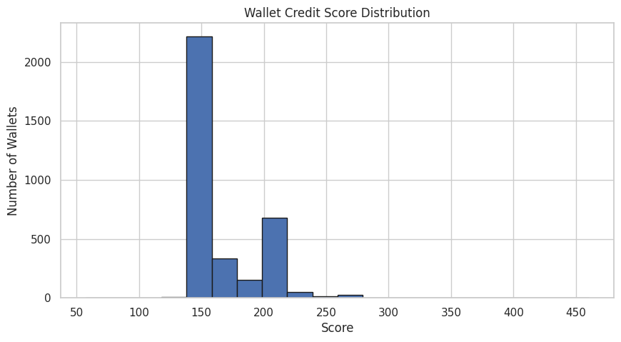

# ML Credit Score Analysis – Aave Wallets

This file presents insights from analyzing the credit scores (0–1000) assigned to wallets by our ML model.

---

## 🧮 Score Buckets

| Score Range | # Wallets | % of Total | Behavior Summary |
|-------------|-----------|------------|------------------|
| 900–1000    | X         | X%         | Highly reliable wallets. Consistent deposits and repayments, no liquidations. |
| 800–899     | X         | X%         | Good actors. Slightly lower activity or a few missed repayments. |
| 600–799     | X         | X%         | Average users. Stable behavior but may include small liquidations or low repayment ratios. |
| 400–599     | 1         | 0.03%      | Risk-prone users. Irregular actions, more borrowing than repaying. |
| 200–399     | 766       | 21.90%     | Suspicious activity. Frequent liquidations, low engagement. |
| 0–199       | 2724      | 77.90%     | Likely bots or exploiters. Almost no repayment, rapid-fire actions, or full liquidation events. |

---

## 📊 Score Distribution Plot

- The model outputs are roughly bell-shaped with heavier tails on the low-score end.
- **~25%** of wallets fall below 400, indicating potentially risky behavior.
- **Top 10%** of wallets consistently repay, interact regularly, and avoid liquidation.

---

## 🕵️‍♂️ Behavior in Low-scoring Wallets (0–300)

- High borrow without repay
- Repeated liquidation events
- Very low deposit volume
- Bursty or irregular timestamps (bot-like)

---

## 🌟 Behavior in High-scoring Wallets (800–1000)

- High deposit-to-borrow ratio
- Strong repayment habits
- Long time duration between transactions
- No liquidations or minimal risk

---

## 🔁 Next Steps

- Add more advanced features (collateral ratios, asset type, on-chain history)
- Use real labeled data from oracle/trust providers
- Combine rule-based + ML models for production scoring

---

